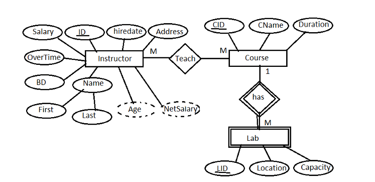
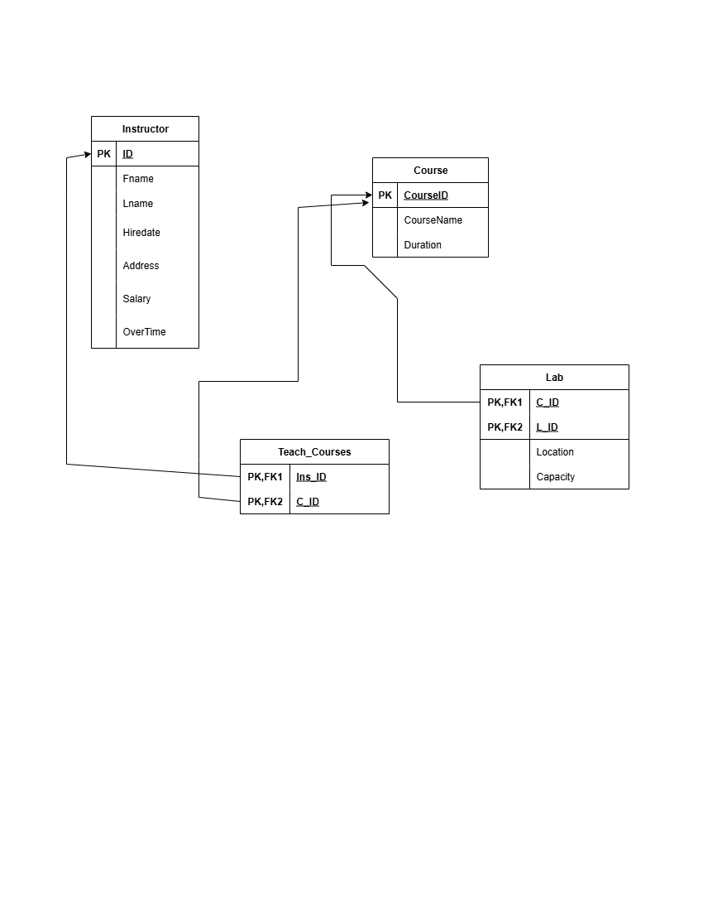

# 🎓 Instructor-Course-Lab Management System

This project represents a **relational database system** for managing instructors, the courses they teach, and the labs used in those courses. It includes an Entity-Relationship (ER) diagram and a relational schema diagram to visualize the design and structure.

---

## 📌 Overview

The system is designed to model:

- Instructors with personal and employment information
- Courses with name and duration
- Labs assigned to courses
- Teaching assignments between instructors and courses

---

## 📷 ER Diagram

This diagram presents the **conceptual model** of the system, including entities, relationships, and attributes (with derived ones dashed).

---

## 🧩 Relational Schema Diagram

The following diagram shows the **logical relational schema** based on the ER model. It includes tables, primary keys, and foreign key relationships.

---

## 🔍 Notes

- The `Instructor` entity includes derived attributes like `Age` and `NetSalary`.
- The relationship between `Instructor` and `Course` is **many-to-many**, handled through a junction table.
- Each `Course` can have **multiple labs** (1:M relationship).
- Each image visually represents how the system is structured before and after normalization.

---

## 📁 Files Included

| File | Description |
|------|-------------|
| `P_1.drawio.png` | ER Diagram |
| `ERD.png` | Relational Schema Diagram |
| `Manag-System.sql` | SQL script for schema creation |

---
